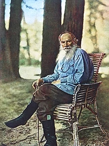

<table class="infobox vcard">
<tbody>
<tr>
<th colspan="2">

Leo Tolstoy

</th>
</tr>
<tr>
<td colspan="2">

Tolstoy on 23 May 1908 at&nbsp;<a title="Yasnaya Polyana" href="https://en.wikipedia.org/wiki/Yasnaya_Polyana">Yasnaya Polyana</a>,&nbsp;photo by&nbsp;<a title="Sergey Prokudin-Gorsky" href="https://en.wikipedia.org/wiki/Sergey_Prokudin-Gorsky">Sergey Prokudin-Gorsky</a>

</td>
</tr>
<tr>
<th scope="row">Native name</th>
<td>

Лев Николаевич Толстой

</td>
</tr>
<tr>
<th scope="row">Born</th>
<td>Lev Nikolaevich Tolstoy 9 September 1828 <a title="Yasnaya Polyana" href="https://en.wikipedia.org/wiki/Yasnaya_Polyana">Yasnaya Polyana</a>,&nbsp;<a title="Tula Governorate" href="https://en.wikipedia.org/wiki/Tula_Governorate">Tula Governorate</a>,&nbsp;<a title="Russian Empire" href="https://en.wikipedia.org/wiki/Russian_Empire">Russian Empire</a></td>
</tr>
<tr>
<th scope="row">Died</th>
<td>20 November 1910&nbsp;(aged&nbsp;82) <a title="Lev Tolstoy (rural locality)" href="https://en.wikipedia.org/wiki/Lev_Tolstoy_(rural_locality)">Astapovo</a>,&nbsp;<a title="Ryazan Governorate" href="https://en.wikipedia.org/wiki/Ryazan_Governorate">Ryazan Governorate</a>, Russian Empire</td>
</tr>
<tr>
<th scope="row">Resting place</th>
<td>Yasnaya Polyana</td>
</tr>
<tr>
<th scope="row">Occupation</th>
<td class="role"><a title="Novelist" href="https://en.wikipedia.org/wiki/Novelist">Novelist</a>,&nbsp;<a title="Short story" href="https://en.wikipedia.org/wiki/Short_story">short story</a>&nbsp;writer,&nbsp;<a title="Playwright" href="https://en.wikipedia.org/wiki/Playwright">playwright</a>,&nbsp;<a class="mw-redirect" title="Essayist" href="https://en.wikipedia.org/wiki/Essayist">essayist</a></td>
</tr>
<tr>
<th scope="row">Language</th>
<td><a title="Russian language" href="https://en.wikipedia.org/wiki/Russian_language">Russian</a></td>
</tr>
<tr>
<th scope="row">Nationality</th>
<td class="category"><a class="mw-redirect" title="Russian people" href="https://en.wikipedia.org/wiki/Russian_people">Russian</a></td>
</tr>
<tr>
<th scope="row">Period</th>
<td>1847&ndash;1910</td>
</tr>
<tr>
<th scope="row">Literary movement</th>
<td><a title="Literary realism" href="https://en.wikipedia.org/wiki/Literary_realism">Realism</a></td>
</tr>
<tr>
<th scope="row">Notable works</th>
<td><em><a title="War and Peace" href="https://en.wikipedia.org/wiki/War_and_Peace">War and Peace</a></em> <em><a title="Anna Karenina" href="https://en.wikipedia.org/wiki/Anna_Karenina">Anna Karenina</a></em> <em><a title="The Death of Ivan Ilyich" href="https://en.wikipedia.org/wiki/The_Death_of_Ivan_Ilyich">The Death of Ivan Ilyich</a></em> <em><a title="The Kingdom of God Is Within You" href="https://en.wikipedia.org/wiki/The_Kingdom_of_God_Is_Within_You">The Kingdom of God Is Within You</a></em> <em><a title="Resurrection (novel)" href="https://en.wikipedia.org/wiki/Resurrection_(novel)">Resurrection</a></em></td>
</tr>
<tr>
<th scope="row">Spouse</th>
<td>

<a title="Sophia Tolstaya" href="https://en.wikipedia.org/wiki/Sophia_Tolstaya">Sophia Behrs</a>&nbsp;(<abbr title="married">m.</abbr>&nbsp;1862)

</td>
</tr>
<tr>
<th scope="row">Children</th>
<td>13</td>
</tr>
<tr>
<td colspan="2">
</td>
</tr>
<tr>
<th scope="row">Signature</th>
<td></td>
</tr>
</tbody>
</table>
 

Count&nbsp;<strong>Lev Nikolayevich Tolstoy</strong>&nbsp;(<a title="Help:IPA/English" href="https://en.wikipedia.org/wiki/Help:IPA/English">/ˈtoʊlstɔɪ,&nbsp;ˈtɒl-/</a>;&nbsp;<a title="Russian language" href="https://en.wikipedia.org/wiki/Russian_language">Russian</a>:&nbsp;Лев Николаевич Толстой,&nbsp;<a title="Romanization of Russian" href="https://en.wikipedia.org/wiki/Romanization_of_Russian">tr.</a>&nbsp;<em lang="ru-Latn" title="Russian-language romanization">Lev Nikol&aacute;yevich Tolst&oacute;y</em>;&nbsp;<small></small><a title="Help:IPA/Russian" href="https://en.wikipedia.org/wiki/Help:IPA/Russian">[lʲef nʲɪkɐˈlaɪvʲɪtɕ tɐlˈstoj]</a>; 9 September&nbsp;[<a title="Old Style and New Style dates" href="https://en.wikipedia.org/wiki/Old_Style_and_New_Style_dates">O.S.</a>&nbsp;28 August]&nbsp;1828&nbsp;&ndash; 20 November&nbsp;[<a title="Old Style and New Style dates" href="https://en.wikipedia.org/wiki/Old_Style_and_New_Style_dates">O.S.</a>&nbsp;7 November]&nbsp;1910), usually referred to in English as&nbsp;<strong>Leo Tolstoy</strong>, was a Russian writer who is regarded as one of the greatest authors of all time.&nbsp;He received multiple nominations for the&nbsp;<a title="Nobel Prize in Literature" href="https://en.wikipedia.org/wiki/Nobel_Prize_in_Literature">Nobel Prize in Literature</a>&nbsp;every year from 1902 to 1906 and nominations for&nbsp;<a title="Nobel Peace Prize" href="https://en.wikipedia.org/wiki/Nobel_Peace_Prize">Nobel Peace Prize</a>&nbsp;in 1901, 1902 and 1910 and the fact that he never won is a major&nbsp;<a title="Nobel Prize controversies" href="https://en.wikipedia.org/wiki/Nobel_Prize_controversies#Literature">Nobel prize controversy</a>.

Born to an aristocratic Russian family in 1828,&nbsp;he is best known for the novels&nbsp;<em><a title="War and Peace" href="https://en.wikipedia.org/wiki/War_and_Peace">War and Peace</a></em>&nbsp;(1869) and&nbsp;<em><a title="Anna Karenina" href="https://en.wikipedia.org/wiki/Anna_Karenina">Anna Karenina</a></em>&nbsp;(1877),&nbsp;often cited as pinnacles of&nbsp;<a title="Literary realism" href="https://en.wikipedia.org/wiki/Literary_realism">realist</a>&nbsp;fiction.&nbsp;He first achieved literary acclaim in his twenties with his semi-autobiographical trilogy,&nbsp;<em><a title="Childhood (Tolstoy novel)" href="https://en.wikipedia.org/wiki/Childhood_(Tolstoy_novel)">Childhood</a></em>,&nbsp;<em><a title="Boyhood (novel)" href="https://en.wikipedia.org/wiki/Boyhood_(novel)">Boyhood</a></em>, and&nbsp;<em><a title="Youth (Leo Tolstoy novel)" href="https://en.wikipedia.org/wiki/Youth_(Leo_Tolstoy_novel)">Youth</a></em>&nbsp;(1852&ndash;1856), and&nbsp;<em><a title="Sevastopol Sketches" href="https://en.wikipedia.org/wiki/Sevastopol_Sketches">Sevastopol Sketches</a></em>&nbsp;(1855), based upon his experiences in the&nbsp;<a title="Crimean War" href="https://en.wikipedia.org/wiki/Crimean_War">Crimean War</a>. Tolstoy's fiction includes dozens of short stories and several&nbsp;<a title="Novella" href="https://en.wikipedia.org/wiki/Novella">novellas</a>&nbsp;such as&nbsp;<em><a title="The Death of Ivan Ilyich" href="https://en.wikipedia.org/wiki/The_Death_of_Ivan_Ilyich">The Death of Ivan Ilyich</a></em>&nbsp;(1886),&nbsp;<em><a title="Family Happiness" href="https://en.wikipedia.org/wiki/Family_Happiness">Family Happiness</a></em>&nbsp;(1859), and&nbsp;<em><a title="Hadji Murat (novel)" href="https://en.wikipedia.org/wiki/Hadji_Murat_(novel)">Hadji Murad</a></em>&nbsp;(1912). He also wrote&nbsp;<a class="mw-redirect" title="Play (theater)" href="https://en.wikipedia.org/wiki/Play_(theater)">plays</a>&nbsp;and numerous philosophical essays.

In the 1870s Tolstoy experienced a profound moral crisis, followed by what he regarded as an equally profound spiritual awakening, as outlined in his non-fiction work&nbsp;<em><a title="A Confession" href="https://en.wikipedia.org/wiki/A_Confession">A Confession</a></em>&nbsp;(1882). His literal interpretation of the ethical teachings of Jesus, centering on the&nbsp;<a title="Sermon on the Mount" href="https://en.wikipedia.org/wiki/Sermon_on_the_Mount">Sermon on the Mount</a>, caused him to become a fervent&nbsp;<a title="Christian anarchism" href="https://en.wikipedia.org/wiki/Christian_anarchism">Christian anarchist</a>&nbsp;and&nbsp;<a class="mw-redirect" title="Anarcho-pacifist" href="https://en.wikipedia.org/wiki/Anarcho-pacifist">pacifist</a>.&nbsp;Tolstoy's ideas on&nbsp;<a title="Nonviolent resistance" href="https://en.wikipedia.org/wiki/Nonviolent_resistance">nonviolent resistance</a>, expressed in such works as&nbsp;<em><a title="The Kingdom of God Is Within You" href="https://en.wikipedia.org/wiki/The_Kingdom_of_God_Is_Within_You">The Kingdom of God Is Within You</a></em>&nbsp;(1894), had a profound impact on such pivotal 20th-century figures as&nbsp;<a title="Mahatma Gandhi" href="https://en.wikipedia.org/wiki/Mahatma_Gandhi">Mahatma Gandhi</a>&nbsp;and&nbsp;<a title="Martin Luther King Jr." href="https://en.wikipedia.org/wiki/Martin_Luther_King_Jr.">Martin Luther King Jr.</a>&nbsp;Tolstoy also became a dedicated advocate of&nbsp;<a title="Georgism" href="https://en.wikipedia.org/wiki/Georgism">Georgism</a>, the economic philosophy of&nbsp;<a title="Henry George" href="https://en.wikipedia.org/wiki/Henry_George">Henry George</a>, which he incorporated into his writing, particularly&nbsp;<em><a title="Resurrection (novel)" href="https://en.wikipedia.org/wiki/Resurrection_(novel)">Resurrection</a></em>&nbsp;(1899).

 

<h2> Books </h2>
<ul>

                             

 <li><a target="_blank" href="https://github.com/manjunath5496/Leo-Tolstoy-Books/blob/master/leot(1).pdf" style="text-decoration:none;">The Three Questions</a></li>

 <li><a target="_blank" href="https://github.com/manjunath5496/Leo-Tolstoy-Books/blob/master/leot(2).pdf" style="text-decoration:none;">A Grain As Big As A Hen's Egg</a></li>

<li><a target="_blank" href="https://github.com/manjunath5496/Leo-Tolstoy-Books/blob/master/leot(3).pdf" style="text-decoration:none;">Ivan the Fool</a></li>
 <li><a target="_blank" href="https://github.com/manjunath5496/Leo-Tolstoy-Books/blob/master/leot(4).pdf" style="text-decoration:none;">God Sees the Truth, But Waits</a></li>                              
<li><a target="_blank" href="https://github.com/manjunath5496/Leo-Tolstoy-Books/blob/master/leot(5).pdf" style="text-decoration:none;">A Calendar of Wisdom</a></li>
<li><a target="_blank" href="https://github.com/manjunath5496/Leo-Tolstoy-Books/blob/master/leot(6).pdf" style="text-decoration:none;">A Letter to a Hindu</a></li>
 <li><a target="_blank" href="https://github.com/manjunath5496/Leo-Tolstoy-Books/blob/master/leot(7).pdf" style="text-decoration:none;">How Much Land Does a Man Need?</a></li>

 <li><a target="_blank" href="https://github.com/manjunath5496/Leo-Tolstoy-Books/blob/master/leot(8).pdf" style="text-decoration:none;">Alyosha the Pot</a></li>
   <li><a target="_blank" href="https://github.com/manjunath5496/Leo-Tolstoy-Books/blob/master/leot(9).pdf" style="text-decoration:none;">Kholstomeer, The Story of a Horse</a></li>
  
   
 <li><a target="_blank" href="https://github.com/manjunath5496/Leo-Tolstoy-Books/blob/master/leot(10).pdf" style="text-decoration:none;">Master and Man </a></li>                              
<li><a target="_blank" href="https://github.com/manjunath5496/Leo-Tolstoy-Books/blob/master/leot(11).pdf" style="text-decoration:none;">A Confession</a></li>
<li><a target="_blank" href="https://github.com/manjunath5496/Leo-Tolstoy-Books/blob/master/leot(12).pdf" style="text-decoration:none;">The Three Hermits</a></li>
<li><a target="_blank" href="https://github.com/manjunath5496/Leo-Tolstoy-Books/blob/master/leot(13).pdf" style="text-decoration:none;">The Death of Ivan Ilyich</a></li>

<li><a target="_blank" href="https://github.com/manjunath5496/Leo-Tolstoy-Books/blob/master/leot(14).pdf" style="text-decoration:none;">Father Sergius</a></li>
                              
<li><a target="_blank" href="https://github.com/manjunath5496/Leo-Tolstoy-Books/blob/master/leot(15).pdf" style="text-decoration:none;">Where Love Is There Is God Also</a></li>

<li><a target="_blank" href="https://github.com/manjunath5496/Leo-Tolstoy-Books/blob/master/leot(16).pdf" style="text-decoration:none;">Three Deaths</a></li>

  <li><a target="_blank" href="https://github.com/manjunath5496/Leo-Tolstoy-Books/blob/master/leot(17).pdf" style="text-decoration:none;">What Men Live By and Other Tales</a></li>   
  
<li><a target="_blank" href="https://github.com/manjunath5496/Leo-Tolstoy-Books/blob/master/leot(18).pdf" style="text-decoration:none;">Treatise of Famous Russian Writer about the Messenger of Islam Muhammad</a></li> 

  
<li><a target="_blank" href="https://github.com/manjunath5496/Leo-Tolstoy-Books/blob/master/leot(19).pdf" style="text-decoration:none;">Plays: Complete Edition, Including the Posthumous Plays</a></li> 

<li><a target="_blank" href="https://github.com/manjunath5496/Leo-Tolstoy-Books/blob/master/leot(20).pdf" style="text-decoration:none;">Boyhood</a></li>

<li><a target="_blank" href="https://github.com/manjunath5496/Leo-Tolstoy-Books/blob/master/leot(21).pdf" style="text-decoration:none;">The Two Old Men</a></li>
<li><a target="_blank" href="https://github.com/manjunath5496/Leo-Tolstoy-Books/blob/master/leot(22).pdf" style="text-decoration:none;">Childhood</a></li> 
 <li><a target="_blank" href="https://github.com/manjunath5496/Leo-Tolstoy-Books/blob/master/leot(23).pdf" style="text-decoration:none;">The Forged Coupon and Other Stories</a></li> 
 

   <li><a target="_blank" href="https://github.com/manjunath5496/Leo-Tolstoy-Books/blob/master/leot(24).pdf" style="text-decoration:none;">What Then Must We Do?</a></li>
 
   <li><a target="_blank" href="https://github.com/manjunath5496/Leo-Tolstoy-Books/blob/master/leot(25).pdf" style="text-decoration:none;">The Cossacks</a></li>                              
 <li><a target="_blank" href="https://github.com/manjunath5496/Leo-Tolstoy-Books/blob/master/leot(26).pdf" style="text-decoration:none;">Youth</a></li>
 <li><a target="_blank" href="https://github.com/manjunath5496/Leo-Tolstoy-Books/blob/master/leot(27).pdf" style="text-decoration:none;">The Gospel in Brief </a></li>
   
 
   <li><a target="_blank" href="https://github.com/manjunath5496/Leo-Tolstoy-Books/blob/master/leot(28).pdf" style="text-decoration:none;">My Religion</a></li>
 
   <li><a target="_blank" href="https://github.com/manjunath5496/Leo-Tolstoy-Books/blob/master/leot(29).pdf" style="text-decoration:none;">The Kingdom of God Is Within You</a></li>                              

  <li><a target="_blank" href="https://github.com/manjunath5496/Leo-Tolstoy-Books/blob/master/leot(30).pdf" style="text-decoration:none;">The Kreutzer Sonata and Other Stories</a></li>
 
   <li><a target="_blank" href="https://github.com/manjunath5496/Leo-Tolstoy-Books/blob/master/leot(31).pdf" style="text-decoration:none;">Sevastopol</a></li> 
    <li><a target="_blank" href="https://github.com/manjunath5496/Leo-Tolstoy-Books/blob/master/leot(32).pdf" style="text-decoration:none;">A Prisoner in the Caucasus </a></li> 

   <li><a target="_blank" href="https://github.com/manjunath5496/Leo-Tolstoy-Books/blob/master/leot(33).pdf" style="text-decoration:none;">The Greatest Short Stories of Leo Tolstoy</a></li>                              

  <li><a target="_blank" href="https://github.com/manjunath5496/Leo-Tolstoy-Books/blob/master/leot(34).pdf" style="text-decoration:none;">Resurrection</a></li> 
 
  <li><a target="_blank" href="https://github.com/manjunath5496/Leo-Tolstoy-Books/blob/master/leot(35).pdf" style="text-decoration:none;">Anna Karenina</a></li> 

  <li><a target="_blank" href="https://github.com/manjunath5496/Leo-Tolstoy-Books/blob/master/leot(36).pdf" style="text-decoration:none;">War and Peace</a></li> 
 
<li><a target="_blank" href="https://github.com/manjunath5496/Leo-Tolstoy-Books/blob/master/leot(37).pdf" style="text-decoration:none;">Hadji Murat</a></li>
 <li><a target="_blank" href="https://github.com/manjunath5496/Leo-Tolstoy-Books/blob/master/leot(38).pdf" style="text-decoration:none;">On Life And Essays On Religion</a></li>
<li><a target="_blank" href="https://github.com/manjunath5496/Leo-Tolstoy-Books/blob/master/leot(39).pdf" style="text-decoration:none;">What is Art?</a></li>
 <li><a target="_blank" href="https://github.com/manjunath5496/Leo-Tolstoy-Books/blob/master/leot(40).pdf" style="text-decoration:none;">Childhood, Boyhood, Youth</a></li> 
 
 </ul>
